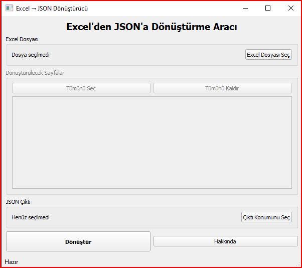

# Excel'den JSON'a Dönüştürücü

Excel dosyalarını JSON formatına dönüştürmek için kullanıcı dostu bir masaüstü uygulaması.



## Özellikler

- Excel dosyalarını (*.xlsx, *.xls) JSON formatına dönüştürme
- Birden fazla sayfa seçme ve işleme
- Sayfaları ayrı JSON nesneleri olarak yapılandırma
- Kolay kullanımlı arayüz
- İlerleme durumunu izleme
- Dosya sistem entegrasyonu

## Kurulum

### Windows için

1. Uygulamanın son sürümünü [buradan indirin](https://github.com/mehmetcimen/excel-to-json/releases/latest)
2. İndirilen kurulum dosyasını çalıştırın
3. Kurulum sihirbazını takip edin

### macOS için

1. Uygulamanın son sürümünü [buradan indirin](https://github.com/mehmetcimen/excel-to-json/releases/latest)
2. DMG dosyasını açın ve uygulamayı Applications klasörüne sürükleyin

### Linux için

```bash
# Gerekli paketleri yükleyin
sudo apt-get install python3-pip python3-pyqt5

# Uygulamayı klonlayın
git clone https://github.com/mehmetcimen/excel-to-json.git

# Uygulama dizinine gidin
cd excel-to-json

# Gerekli Python paketlerini yükleyin
pip3 install -r requirements.txt

# Uygulamayı çalıştırın
python3 main.py
```

## Kullanım

1. "Excel Dosyası Seç" butonuna tıklayın ve dönüştürmek istediğiniz Excel dosyasını seçin
2. Dönüştürülecek sayfaları seçin (varsayılan olarak tüm sayfalar seçilidir)
3. İsterseniz "Çıktı Konumunu Seç" butonuyla JSON dosyasının kaydedileceği konumu değiştirin
4. "Dönüştür" butonuna tıklayarak dönüştürme işlemini başlatın
5. İşlem tamamlandığında, başarı mesajıyla birlikte oluşturulan JSON dosyası hakkında bilgilendirileceksiniz

## JSON Çıktı Formatı

Dönüştürme sonucunda oluşturulan JSON dosyası aşağıdaki yapıda olacaktır:

```json
{
    "Sayfa1": [
        {
            "Sütun1": "Değer1",
            "Sütun2": "Değer2",
            ...
        },
        ...
    ],
    "Sayfa2": [
        ...
    ],
    ...
}
```

Her Excel sayfası bir JSON anahtarı olarak temsil edilir ve bu anahtarın değeri, sayfadaki satırların bir dizi olarak gösterildiği bir koleksiyondur. Her satır, sütun adlarını anahtar olarak kullanır.

## Gereksinimler

- Python 3.6 veya üzeri
- PyQt5
- pandas
- openpyxl

## Proje Yapısı

```
excel-to-json/
│
├── main.py               # Ana uygulama dosyası
├── requirements.txt      # Python paket gereksinimleri
├── LICENSE              # Lisans bilgisi
└── README.md            # Bu dosya
```

## Sorun Giderme

**S: Excel dosyasını okurken hata alıyorum.**

C: Excel dosyanızın başka bir uygulama tarafından açık olmadığından emin olun. Ayrıca, dosya üzerinde yazma izninizin olduğunu kontrol edin.

**S: Türkçe karakterlerde sorun yaşıyorum.**

C: Uygulama, JSON dosyalarını UTF-8 kodlamasıyla oluşturur. Oluşturulan JSON dosyasını açarken kullandığınız metin düzenleyicinin UTF-8 kodlamasını desteklediğinden emin olun.

**S: Büyük Excel dosyalarında uygulama çok yavaş çalışıyor.**

C: Büyük Excel dosyaları için daha fazla bellek gerekebilir. Dönüştürme işlemi, dosya boyutuna bağlı olarak zaman alabilir. İşlem sırasında sabırlı olun ve uygulamanın yanıt vermediğini düşünmeyin.

## Geliştirme

Bu uygulamayı geliştirmek için:

1. Depoyu klonlayın: `git clone https://github.com/mehmetcimen/excel-to-json.git`
2. Bağımlılıkları yükleyin: `pip install -r requirements.txt`
3. Kodu düzenleyin ve iyileştirin
4. Pull request gönderin

## Lisans

Bu proje MIT lisansı altında lisanslanmıştır. Detaylı bilgi için [LICENSE](LICENSE) dosyasına bakın.

## İletişim ve Katkıda Bulunma

Geliştirici: Mehmet ÇİMEN

Web sitesi: [https://mehmetc.dev](https://mehmetc.dev)

Hata raporları, özellik istekleri ve katkıda bulunma için [GitHub Issues](https://github.com/mehmetcimen/excel-to-json/issues) sayfasını kullanabilirsiniz.